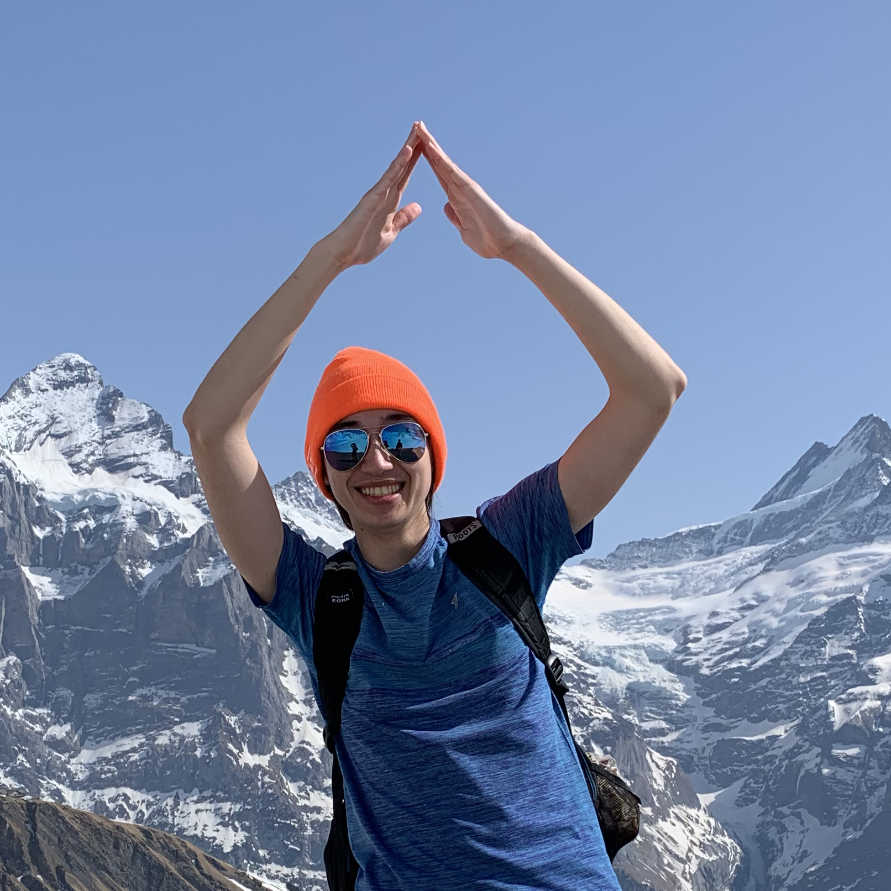

# David Rousso

Hello! I am a fourth-year experimental particle physics PhD student in the [High Energy Physics Group](https://www.hep.phy.cam.ac.uk) in the Cavendish Laboratory at the University of Cambridge as a member of the ATLAS Collaboration on the Large Hadron Collider (LHC) at CERN, funded by Gates Cambridge. 

My research is on searches for new particles beyond the standard model in ATLAS that may live long enough to travel some distance through the detector before decaying.

I also designed and developed the ATLAS inner tracker upgrade (ITk) semiconductor strips sensors quality control software framework, do teaching (supervisions/TAing) at Cambridge, and do outreach at CERN.

(Much like my thesis, this website is currently just an empty shell under construction, but will eventually be filled with my research interests and history, CV, and resources I have created for my teaching. `#testinginprod`)

